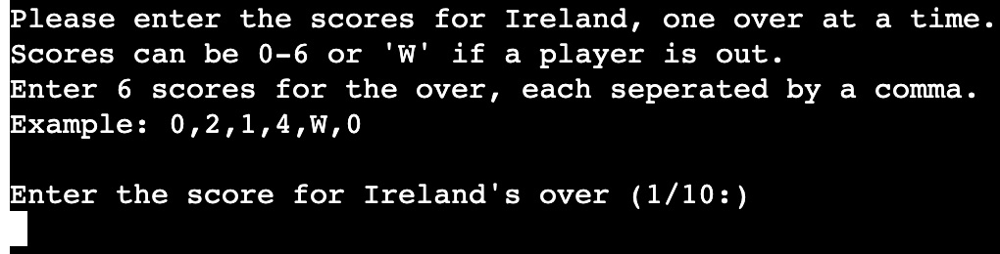
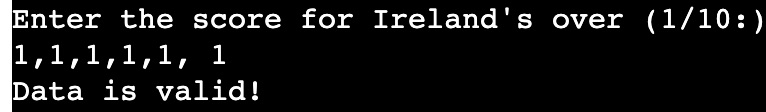
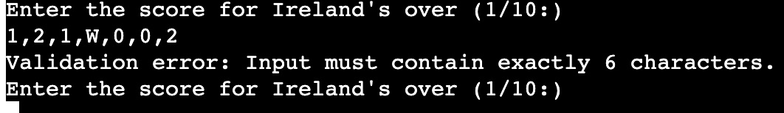
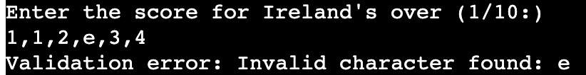
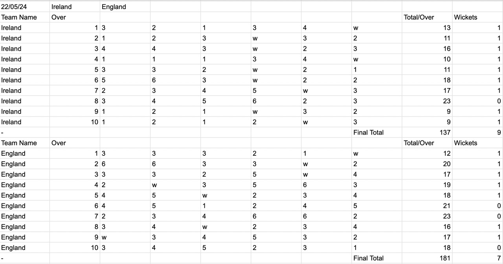
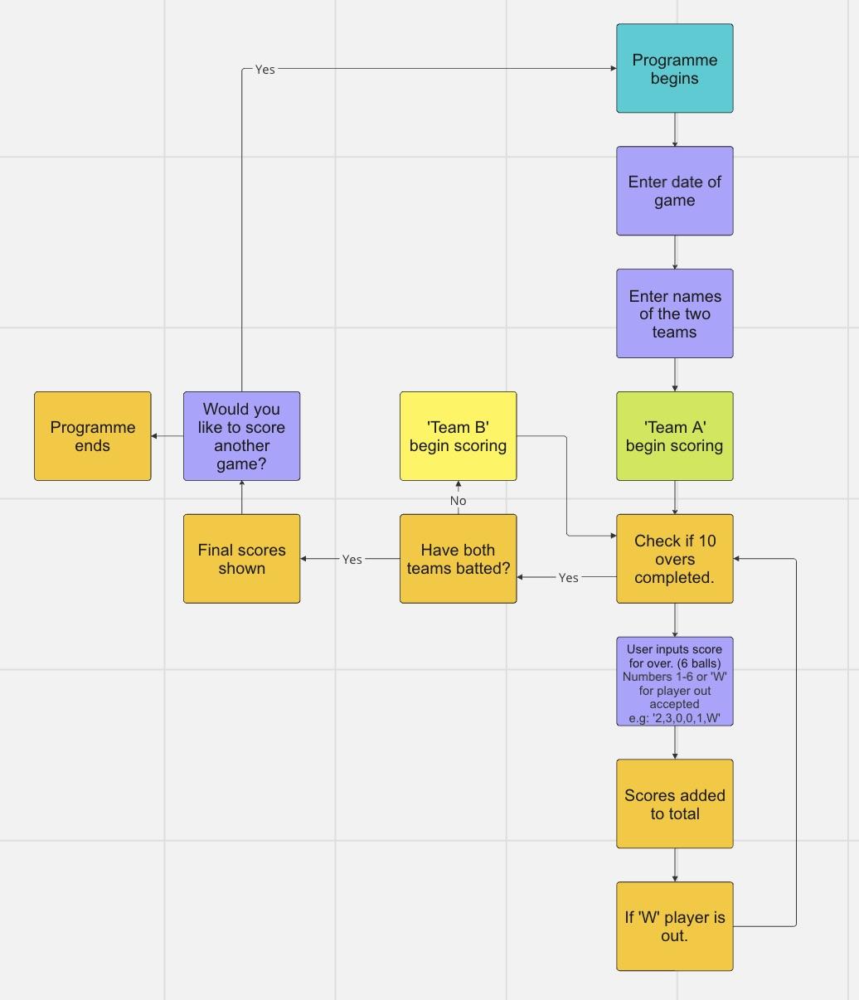
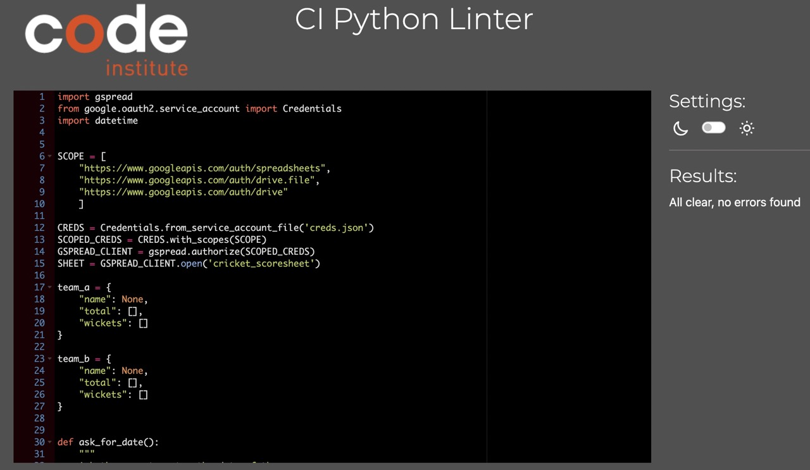
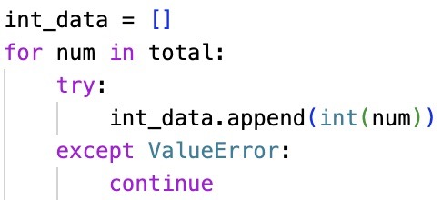

# Cricket Scoresheet

Welcome user,

Cricket Scoresheet is a Python Terminal project, that allows you to keep score during a game of cricket.
You will be asked to input data through the terminal, which in turn updates the Cricket Scoresheet on Google Sheets.
After the whole game has been scored you will be informed of which team is the winner. 

The terminal can be accessed by this [link](https://cricket-scoresheet-0bbdfb6c6880.herokuapp.com/)

---

## Rules for Cricket

#### Cricket games have many different formats. For this game the following rules apply:

* Two teams play against each other, each with 11 players.
* Each team has a batting innings, where they score points.
* An innings consists of 10 overs per team (6 scores per over).
* One member of the batting team scores at a time.
* They continue scoring until they are out, the next then player continues scoring for the team.
* The team continue scoring for the full 10 overs.
* If all 11 players were to get out within 10 overs, the players re-enter to score again.
* After the first teams innings, the second team begins their innings.
* After both teams have had a batting innings, the result is announced.
* The team with the highest score is the winner.
* If scores are tied, the team with the fewest players out is the winner.
* If scores are tied and players out is tied, the game is a draw.

## How to use the program

* The user is the person keeping the score for the game of cricket.
* The user is firstly asked to enter the date of the game.
* The date needs to be entered in the format (dd/mm/yy).
* The two team names are then asked to be inputted, one at a time.
* Team names should be a minimum of 3 characters long.
* The user is then asked to input the scores for the first teams innings.
* Each teams innings consists of 10 overs (6 scores per over).
* Each score can be between 0-6, or a 'W' to represent a player getting out.
* The six scores per over are entered with a comma between them.
* Example of an input for one overs score: 2,3,4,0,W,1.
* The program updates the scoresheet on Google Sheets as scores are inputted.
* After scoring the first teams 10 overs, the next team begin scoring.
* When both teams have scored, the winner is announced.
* The team with the higher score will be announced as the winner.
* If both teams have equal scores, the team with the fewest wickets (players getting out, represented by 'W') is the winner.
* The user is then asked if they want to score another game, or leave the program.

---

## User stories

### First Time Visitor Goals

* As a first time visitor, I want to easily understand what the program is about. 
* As a first time visitor, I want to be able to easily navigate through the scoresheet.
* As a first time visitor, I want to be able to score the game and determine who is the winner.

### Returning Visitor Goals

* As a returning visitor, I want to be able to score multiple games.
* As a returning visitor, I want to view scoresheets from previous games.

---

## Features

* Welcome message greets the user as the program begins.

* User is asked to enter the date in the format dd/mm/yy.
* If an invalid date is entered, the user is asked to re-enter the date.
* The date is used on the scoresheet to mark the date of the game.

* User is then asked to enter the two teams name.
* Each team name must be a minimum of 3 characters.
* The user will be asked to re-enter until a valid name is entered.

* The first team begin their innings
* Each innings will consist of 10 overs, each over will be inputted during the innings.
* An over consists of 6 scores, each ranging from 0-6, or 'W' is a player is out.
  
  - 'Data is valid' is printed in the terminal if the score is entered correctly.
  
  - Validation error if more than 6 scores entered.
  - User is asked to input the score for that over again. 
  
  - Validation error if incorrect character entered.
  - User is asked to input the score for that over again.

* Innings complete message is printed in the terminal when the user has finished scoring the first team.

* The user is then asked to begin scoring the second team.

* Innings complete message is printed in the terminal when the user has finished scoring the second team.

* The final scores for the game are then shown in the terminal.
* The winning team is announced.

* The user is asked if they want to score again.
* If 'yes' is entered, the program starts again, ready to score another game.
   
---

### Google Worksheet

* As data is entered it is appended to the scoresheet on Google Sheets.
* The top of the scoresheet has the date and the two teams name.
* The first teams 10 overs are then listed
* After each over the total for that over is shown as well as wickets.
* After 10 overs, the total score is shown, and total wickets lost.
* The second teams score is then shown below.

---
- ### Flowchart

* This flowchart helps show the logic used for the programme.

---

### Technologies Used

- [Python 3.8.5](https://www.python.org/downloads/release/python-385/): used to anchor the project and direct all application behavior
- [Miro](https://miro.com/app/) - was used to create a workflow.
- [Gitpod](https://www.gitpod.io/) - was used as the main tool to write and edit code.
- [GitHub](https://github.com/) - was used to host the code of the website.
- [Heroku](https://id.heroku.com/login) - was used for deployment.

---

### Testing

## Validator Testing

- 

* The code passed with validation without error.

### Bugs

#### Solved bugs

* The `calculate_total()` function calculates the total score for each over. As an over can include a non-integer 'W', which represents a player getting out, an error appeared when trying to add the data. To resolve this I created a list of just the integers from the over, ignoring any 'W's.
  - 

* When the scores are being inputted, I used `replace(" ", "")` to remove any whitespace in the data. I used this method to try and prevent an empty field being appecpted. When testing I found that the function still accepted a `,` without any data after it as an input. To resolve this I used `filter(None)` method to remove any data of value `None` from the list.
  - 

#### Unresolved bugs

* When the programme has finished, and the winning team has bee announced, the user is asked if they wish to score another game. If `yes` is entered, the programme starts again ready to score another game. Any other input for this qustion, including an empty field, will finish the programme. To prevent this I would look to validate the input, where `yes` starts again, `no` would end the programme, and any other input would be invalid.

## Deployment to Heroku

#### To run as a remote web application:

  1. Create a Heroku account if you don't already have one here Heroku.
  1. Create a new Heroku application on the following page here New Heroku App.
  1. Go to the Deploy tab.
  1. Deployment Method.
  1. Link your GitHub account and connect the application to the repository you created.
  1. Go to the Settings tab.
  1. Click "Add buildpack".
  1. Add the Python and Node.js buildpacks in the following order:
  1. Click "Reveal Config Vars."
  1. Add 1 new Config Vars:
      -Key: PORT Value: 8000 (This Config was provided by CODE INSTITUTE.)
  1. Go back to the Deploy tab.
  1. Click "Deploy Branch".
  1. Click "Open app" to launch the application inside a web page.

The live link can be found [here](https://cricket-scoresheet-0bbdfb6c6880.herokuapp.com/)

---

## Future Improvements

* I would like to improve the scoring system to include individual players scores.
* I would like to be able to score different formats of the cricket game:
  - 20 over games.
  - 50 over games.
  - 5 day games.

---

## Acknowledgements

* [Code Institute](https://codeinstitute.net/) tutors, mentor and Slack community members for their support and help.
* Cristina Bonilla, my partner, for her continued support and help with testing.