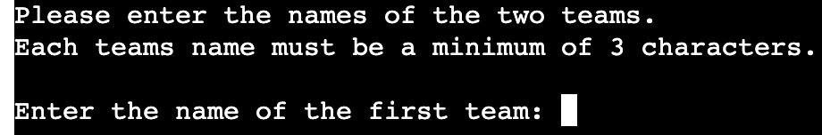

# Cricket Scoresheet

Welcome user,

Cricket Scoresheet is a Python Terminal project, that allows you to keep score during a game of cricket.
You will be asked to input data through the terminal, which in turn updates the Cricket Scoresheet on Google Sheets.
After the whole game has been scored you will be informed of which team is the winner. 

The terminal can be accessed by this [link](https://cricket-scoresheet-0bbdfb6c6880.herokuapp.com/)

---

## Rules for Cricket

#### Cricket games have many different formats. For this game the following rules apply:

* Two teams play against each other, each with 11 players.
* Each team has a batting innings, where they score points.
* An innings consists of 10 overs per team (6 scores per over).
* One member of the batting team scores at a time.
* They continue scoring until they are out, the next then player continues scoring for the team.
* The team continue scoring for the full 10 overs.
* If all 11 players were to get out within 10 overs, the players re-enter to score again.
* After the first teams innings, the second team begins their innings.
* After both teams have had a batting innings, the result is announced.
* The team with the highest score is the winner.
* If scores are tied, the team with the fewest players out is the winner.
* If scores are tied and players out is tied, the game is a draw.

## How to use the program

* The user is the person keeping the score for the game of cricket.
* The user is firstly asked to enter the date of the game.
* The date needs to be entered in the format (dd/mm/yy).
* The two team names are then asked to be inputted, one at a time.
* Team names should be a minimum of 3 characters long.
* The user is then asked to input the scores for the first teams innings.
* Each teams innings consists of 10 overs (6 scores per over).
* Each score can be between 0-6, or a 'W' to represent a player getting out.
* The six scores per over are entered with a comma between them.
* Example of an input for one overs score: 2,3,4,0,W,1.
* The program updates the scoresheet on Google Sheets as scores are inputted.
* After scoring the first teams 10 overs, the next team begin scoring.
* When both teams have scored, the winner is announced.
* The team with the higher score will be announced as the winner.
* If both teams have equal scores, the team with the fewest wickets (players getting out, represented by 'W') is the winner.
* The user is then asked if they want to score another game, or leave the program.

---

## User stories

### First Time Visitor Goals

* As a first time visitor, I want to easily understand what the program is about. 
* As a first time visitor, I want to be able to easily navigate through the scoresheet.
* As a first time visitor, I want to be able to score the game and determine who is the winner.

### Returning Visitor Goals

* As a returning visitor, I want to be able to score multiple games.
* As a returning visitor, I want to view scoresheets from previous games.

---

## Features

* Welcome message greets the user as the program begins.

* User is asked to enter the date in the format dd/mm/yy.
* If an invalid date is entered, the user is asked to re-enter the date.
* The date is used on the scoresheet to mark the date of the game.

* User is then asked to enter the two teams name.
* Each team name must be a minimum of 3 characters.
* The user will be asked to re-enter until a valid name is entered.

* The first team begin their innings
* Each innings will consist of 10 overs, each over will be inputted during the innings.
* An over consists of 6 scores, each ranging from 0-6, or 'W' is a player is out.
  
  - 'Data is valid' is printed in the terminal if the score is entered correctly.
  
  - Validation error if more than 6 scores entered.
  - User is asked to input the score for that over again. 
  
  - Validation error if incorrect character entered.
  - User is asked to input the score for that over again.

* Innings complete message is printed in the terminal when the user has finished scoring the first team.

* The user is then asked to begin scoring the second team.

* Innings complete message is printed in the terminal when the user has finished scoring the second team.

* The final scores for the game are then shown in the terminal.
* The winning team is announced.

   
---

- ### Footer

* The footer is positioned at the bottom of the page.
* It contains the author for the game.
* There is a link to the authors GitHub Page via an icon.
* The link has hover properties and opens in a new page.  

---

- ### Start section

* The page has a short paragraph informing the user what the game is about.
* It instructs users to enter their name and click start to begin the game.
* Names are to be entered inside the input field.
* If no name is entered before clicking start, an alert will pop-up to remind the user to enter a name.
* A circular button labelled 'Start' is clicked to begin the game.

* The text is responsive, increasing in size for larger screen sizes.

---

- ### Questions section

* The question is displayed in large text within a golden yellow banner.
* There is an answer area where the user can input their answer.
* If no answer is entered, the user is alerted to enter an answer before continuing.
* There is a submit input to click to check the answer. (the user can also use the enter key).
* After an answer has been submitted it is checked and added to the score.

* Towards the bottom of the section is the score area.
* Correct scores are talleyed and displayed after a correct answer.
* Incorrect scores are talleyed and displayed after an incorrect answer.
* Another question is then shown.
* 10 questions are asked in total, before the game finishes.
* The text is responsive, increasing in size for larger screen sizes.

--- 

- ### Results section

* After 10 questions have been answered, the user is shown the results section.
* A personalised message is displayed, showing the users name and their final score.
* There is a button with a link to allow the user to play again.

---

### Technologies Used

- [HTML](https://developer.mozilla.org/en-US/docs/Web/HTML) - was used as the foundation of the game.
- [CSS](https://developer.mozilla.org/en-US/docs/Web/css) - was used to add the styles and layout of the game.
- [JavaScript](https://developer.mozilla.org/en-US/docs/Learn/javascript) - was used to arrange items on the pages.
- [Balsamiq](https://balsamiq.com/) - was used to make wireframes for the game.
- [Miro](https://miro.com/app/) - was used to create a workflow.
- [Gitpod](https://www.gitpod.io/) - was used as the main tool to write and edit code.
- [GitHub](https://github.com/) - was used to host the code of the website.
- [PineTools](https://pinetools.com/) - was used to find colors from image.

---

## Design

### Colour

* The shades of blue were taken from the image and used throughout the styling of the game.
* The main background of the game is the lighter blue from the image.
* The dark blue is used for the footer and the buttons.
* A golden yellow was used as a banner for the name area and when displaying questions, as well as some border styling. It was chosen as it contrasts well with the blue. The blue and gold also have associations with Europe from the flag of the European Union.
* A coral shade of pink was used for the score area. This ensures the area stands out and contrasts well with the light blue background.

### Typography

* Outfit was used as the main font of the game in order to increase readability of the content on the pages.

### Wireframe

* I used Balsamiq to create a wireframe of my idea

### Workflow

* I used Miro to create a workflow of my idea

---

## Testing

### Compatibility

In order to confirm the correct functionality, responsiveness and appearance the game was tested on: 

* Chrome

* Safari

* Firefox

### Responsiveness

In orfer to cofirm the responsiveness of the game, devtools was used to check the game on different screen sizes:

* Phone

 

* Tablet

* Laptop

### Validator Testing

- #### HTML

No errors or warnings were found when passing through the official W3C validator.

- #### CSS

No errors or warnings were found when passing through the official W3C (Jigsaw) validator.

- #### JavaScript

No errors or warnings were found when passing through the official jshint validator.

---

### Lighthouse Report

---

### Manual Testing

Maunal tests carried out by multiple users:

* The name can be entered into the name input field
* If no name is entered, an alert pops-up to remind the user to enter a name
* The button labeled 'Start' begins the game
* The button labeled 'Start' has hover styling when the cursor is on it
* Answers can be entered in the answer input field
* If no answer is entered, an alert pops-up to remind the user to enter an answer
* All cases of answers are accepted; lowercase, uppercase, camelCase.
* The submit input can be clicked to check the users answer
* The submit input has hover styling, when the cursor is on it
* Answers can also be checked using the 'Enter' key
* The answer field is emptied after each question, so the user doesn't need to delete the previous answer
* The correct and incorrect scores are talleyed as the game progresses. 
* No questions are repeated during the cycle of the game
* The game ends after 10 questions have been asked
* A personalised message is displayed with the users final correct score
* The users name is displayed in capital letters, regardless of how it was entered in the name field
* The 'Play Again' button takes the user back to the start of the game to repeat the game
* The 'Play Again' button has hover styling when the cursor is on it
* A different selection of questions are asked when the game is played again
* Authors GitHub page loads in a new page, from the link in the footer
* The GitHub logo has hover properties when the cursor is on it
  
### Bugs

#### Solved bugs

* I noticed that users answers were being marked incorrectly, even when spelt correctly, when they used different capitalisation than the actual answer. To solve this, I first used the `toLowerCase()` method to change the users answer to lowercase. The actual answer was also written in lowercase, this allowed the two answers to be checked regarding spelling, as opposed to different capitalisation. 

* When checking the HTML code through the validator, I had errors where the three `<section>` of the game were without headings. I added heaadings for each section, and used the `visibility:hidden` styling property, so the headings were not visible during the game.

## Deployment

### Deployment to GitHub Pages

- The site was deployed to GitHub pages. The steps to deploy are as follows: 
  - In the [GitHub repository](https://github.com/l-copeman/european-countries), navigate to the Settings tab 
  - From the source section drop-down menu, select the **Main** Branch, then click "Save".
  - The page will be automatically refreshed with a detailed ribbon display to indicate the successful deployment.

The live link can be found [here](https://l-copeman.github.io/european-countries/index.html)

---

## Future Improvements

* I would like to add more questions, and offer a greater range of topics (different continents and questions regarding national flags).
* I would like to show the user the correct answer when they have entered an incorrect answer.
* I would like to change the 'Play Again' button so it takes the user back to the beginning of the game without having to reload the page. I would look to do this by using the `classList.remove/classList.add` method on the elements. This will speed up the loading time and create a better user experience.

---

## Credits

#### Images

Image was taken from:
* [iStock](https://www.istockphoto.com/)

---

## Acknowledgements

* [Code Institute](https://codeinstitute.net/) tutors, mentor and Slack community members for their support and help.
* Cristina Bonilla, my partner, for her support, design guidance and help with testing.